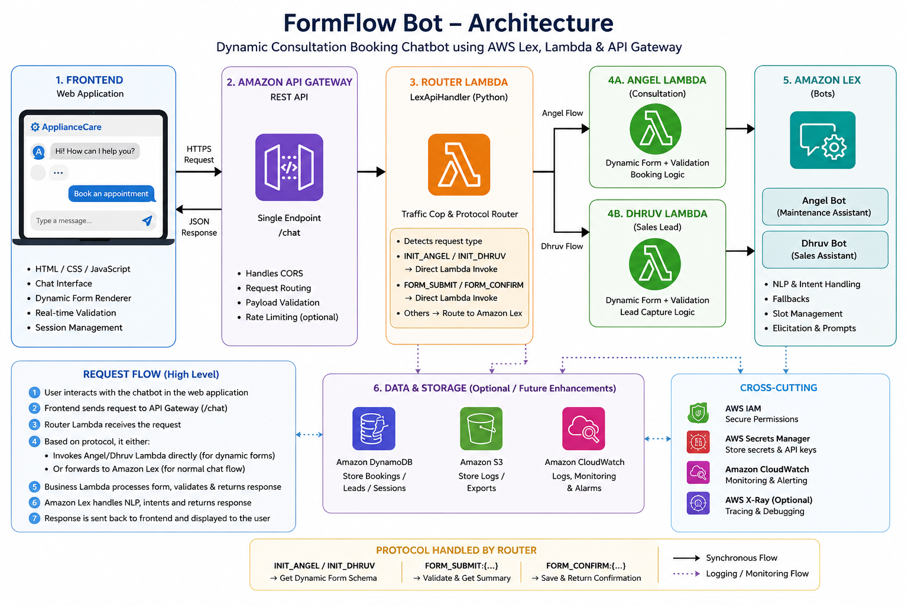
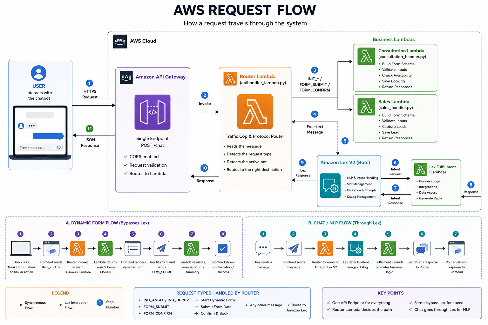

# aws-dynamic-chatbot

An AI-powered multi-assistant chatbot built using **AWS Lex V2, AWS Lambda, API Gateway, Gemini, HTML, CSS, and JavaScript**.

The chatbot supports three business workflows behind one chat widget:

- **Angel — Product Consultation** (`consultation_handler.py`) – Product advice, maintenance, installation, appliance servicing.
- **Dhruv — Sales / Purchase** (`sales_handler.py`) – Purchase help, pricing, sales leads, callback requests.
- **Krishna — Cloud & IT Services** (`service_lambda.py`) – Cloud consulting, migration, DevOps, technical support.

Users never have to hunt for the right assistant: the router reads what they typed, classifies which of the three areas it belongs to, and opens that form after a quick confirmation — or the user can just click a bot directly. Free-form company/cloud/IT questions are answered live by **Gemini** at any point — before a bot is picked, mid-slot-filling, or with the form open — without breaking the booking flow.

---

# Design Principle

> **The backend controls the workflow. The frontend only renders it.**

All business logic — form schemas, validation, product lists, appointment slots, intent classification, FAQ answers — lives inside the AWS Lambda functions.

The frontend is only responsible for:

- Rendering the chat interface
- Displaying dynamic forms
- Sending user input (plus lightweight session state: `lastPrompt`, `pendingBot`, `formOpen`) to the backend
- Displaying whatever the backend returns

Any change to form fields, labels, validation rules, product lists, appointment dates/times, intent-routing keywords, or FAQ behavior is made inside the Lambda functions — not in the frontend.

---

# Architecture



---

# AWS Request Flow



---

# System Architecture

```
                          User
                            │
                            ▼
           HTML / CSS / JavaScript Frontend
                            │
                            ▼
                Amazon API Gateway
                            │
                            ▼
                    Router Lambda
              (apihandler_lambda.py)
       ┌─────────────────┬─────────────────┬───────────────┐
       │                 │                 │               │
       ▼                 ▼                 ▼               ▼
form_intent.py      gemini_faq.py     Amazon Lex V2   Business Lambda
(intent routing,   (FAQ / company &   (booking dialog  (consultation_handler /
 keyword+Gemini     cloud-IT Q&A,      + slot filling)  sales_handler /
 classification)     local fallback)         │           service_lambda)
       │                 │                   │               │
       └─────────────────┴─────────┬─────────┴───────────────┘
                                    ▼
                        Response back to Frontend
```

The router is the single entry point for every request. It decides, per message, whether to:

1. Answer directly (small talk, demo video request, Gemini diagnostics)
2. Classify intent and offer/confirm a form (`form_intent.py`)
3. Answer a knowledge question via Gemini without touching Lex (`gemini_faq.py`)
4. Forward to Amazon Lex for normal slot-filling dialogue
5. Bypass Lex entirely and call a business Lambda directly for the dynamic form protocol (`INIT_*` / `FORM_SUBMIT:` / `FORM_CONFIRM:`)

---

# Features

- Three AI assistants behind one chat widget, auto-routed by intent
- Natural-language form routing — no need to click a bot first ("I need pricing for a new fridge" opens the sales form after a yes/no confirmation)
- Dynamic, schema-driven consultation/sales/service forms — fields, options, and validation are 100% backend-defined
- Gemini-powered FAQ layer — answers company and general cloud/IT questions inline, before or during a booking, without losing the user's place in the conversation
- Deterministic local-answer fallback when Gemini is unavailable, so common questions still get answered instantly
- Built-in Gemini self-diagnostics (`GEMINI_DIAG`) — reports exactly why an answer failed (missing key, bad model, quota, timeout) without digging through CloudWatch
- Small-talk handling ("thanks", "bye", etc.) that never disturbs the Lex session or the open form
- Inline demo video playback, triggerable anywhere in the conversation
- Real-time slot/form validation (phone, email, product, date, time)
- Session management, "back to where we were" resumption after any interruption
- Responsive web interface

---

# Repository Structure

```
aws-dynamic-chatbot/
│
├── backend/
│   ├── lambda functions/
│   │   ├── consultation_handler.py   # Angel — product consultation
│   │   ├── sales_handler.py          # Dhruv — sales / purchase
│   │   └── service_lambda.py         # Krishna — cloud & IT services
│   │
│   ├── router/
│   │   ├── apihandler_lambda.py      # single entry point / orchestrator
│   │   ├── form_intent.py            # keyword + Gemini intent classification
│   │   └── gemini_faq.py             # Gemini FAQ layer + local fallback answers
│   │
│   └── requirements.txt
│
├── frontend/
│   ├── index.html
│   ├── script.js
│   ├── style.css
│   └── config.js
│
├── docs/
│   ├── architecture.png
│   └── screenshots/
│       └── aws_flow.png
│
├── .gitignore
└── README.md
```

---

# Backend Components

## Router Lambda — `backend/router/apihandler_lambda.py`

The single Lambda behind API Gateway. Every request from the frontend lands here first.

Responsibilities:

- Receives requests from API Gateway
- Runs the Gemini self-test (`GEMINI_DIAG`)
- Handles form-choice confirmation (`CONFIRM_BOT:` / `DECLINE_BOT`) after `form_intent.py` suggests an area
- Handles demo video requests without touching Lex state
- Handles small talk (`form_intent.smalltalk_reply`) without touching Lex or the open form
- Classifies action-shaped free text ("I want to book a consultation") into a bot suggestion via `form_intent.classify()`
- Routes knowledge questions to `gemini_faq.py` — Lex is **not** called on those turns, so the current slot/dialog state is preserved and the last question the bot asked is re-shown afterward
- Dispatches the dynamic-form protocol (`SELECT_BOT:`, `INIT_<BOT>`, `FORM_SUBMIT:`, `FORM_CONFIRM:`) directly to the matching business Lambda via `boto3.client('lambda').invoke(...)` — Lex is bypassed for this entire flow
- Forwards everything else to Amazon Lex V2 (`recognize_text`) for normal slot-filling conversation, and tracks `lastPrompt` (the question Lex just asked) so an interruption can be resumed cleanly

## Intent Router — `backend/router/form_intent.py`

Decides *which* of the three forms a free-text message wants, so the user doesn't have to click a bot button first.

- **Pass 1 — keyword scoring**: fast, free, deterministic. Scores the message against per-bot keyword lists (`_KEYWORDS`), with decisive overrides for clearly sales-shaped or advice-shaped language.
- **Pass 2 — Gemini classification**: only runs when keywords find nothing. Asks Gemini to return exactly one word (`angel` / `dhruv` / `krishna` / `none`).
- Also owns: small-talk replies, demo-video detection, yes/no parsing for the confirm step, and slot-value shape detection (so things like an email or a date never get misrouted into intent classification).
- Falls back gracefully to keyword-only classification (plus a clarifying "which of these do you need?" question) if `GEMINI_API_KEY` isn't set.

## Gemini FAQ Layer — `backend/router/gemini_faq.py`

Answers general company / cloud-IT questions with Gemini so the bot can respond to things Lex was never trained on ("what is cloud computing?", "what does your company do?") — **without ever touching the Lex session**.

- `is_knowledge_question()` — a conservative gate: when in doubt, it defers to Lex, since a misrouted slot answer breaks the booking flow, while a missed FAQ just becomes a normal Lex turn.
- `answer()` — calls the Gemini REST endpoint directly (`x-goog-api-key` header, no SDK/dependency needed) with a 3-attempt fallback ladder: configured model with thinking disabled → same model without `thinkingConfig` → a known-good fallback model, in case `GEMINI_MODEL` is invalid or retired.
- `local_answer()` — a deterministic, hardcoded backup answer set (company overview, cloud computing, AWS, migration, DevOps, security) used whenever Gemini is unavailable, misconfigured, rate-limited, or times out, so common questions are still answered instantly.
- `diagnose()` — a live self-test surfaced through the `GEMINI_DIAG` chat command, reporting exactly why Gemini isn't answering (key missing, bad model, HTTP status, quota) instead of requiring a CloudWatch log dive.

## Business Lambdas

Each business Lambda is a self-contained booking workflow: dynamic form schema, Lex slot-filling fulfillment, validation, and demo-video interception (`_is_demo_request` mid-dialog). None of them talk to Gemini directly — that responsibility lives entirely in the router, so the business Lambdas stay focused purely on their own booking domain.

**`consultation_handler.py` (Angel)** — Product consultation: Refrigerator / Television / Washing Machine / Dishwasher. Fields: name, gender, phone, email, product, bill image upload, issue description, preferred date/time, notification preference.

**`sales_handler.py` (Dhruv)** — Purchase consultation: same product catalog as Angel, sales-oriented flow (pricing/purchase framing) with the same field set minus gender.

**`service_lambda.py` (Krishna)** — Cloud & IT services: Cloud Architecture & Migration / Enterprise Solutions / Cloud Messaging / AI & ML Integration. Includes **per-product dynamic follow-up questions** (`DYNAMIC_QUESTIONS`) — e.g. picking "Cloud Architecture & Migration" asks which cloud platform and migration timeline — plus an optional call-scheduling step.

All three share: env-driven demo video config (`DEMO_VIDEO_URL`, `DEMO_MESSAGE`, `DEMO_BUTTON_LABEL`, `DEMO_TRIGGERS`), phone/email validation, business-day + time-slot availability calculation, and the same dynamic form protocol contract (`INIT` / `SUBMIT` / `CONFIRM` form actions, `DialogCodeHook`/`FulfillmentCodeHook` Lex handling).

---

# Frontend Components

## `index.html`
Chat widget markup, including the collapsible tutorial video player and the restart-confirmation modal.

## `config.js`
Holds `CONFIG.API_URL` (your deployed API Gateway endpoint) and `CONFIG.VIDEO` (the tutorial video source). No business logic — just deployment-specific configuration.

## `style.css`
Styling for the chat interface, dynamic forms, buttons, and responsive layout.

## `script.js`
- Renders chat bubbles, cards, buttons, and the schema-driven form (`FormRenderer` / `FormFlow`)
- Sends every user action to the router, along with `lastPrompt`, `pendingBot`, and `formOpen` so the backend can decide how to respond without losing conversational context
- Renders whichever bot the backend says is now active (`sessionAttributes.selectBot`) — the frontend never decides which bot to open on its own
- Plays the inline demo video and re-asks the pending question once it finishes
- Contains zero form schema, product lists, validation rules, or intent-classification logic — 100% backend-driven

---

# Request Flow

### Natural-language routing flow (no bot clicked yet)

```
User types free text
      │
      ▼
   Frontend
      │
      ▼
  API Gateway
      │
      ▼
 Router Lambda
      │
      ▼
form_intent.classify()  →  keyword pass  →  (miss) →  Gemini pass
      │
      ▼
 Confident match? → confirm card ("shall I open that form?")
 No match?         → "which of these do you need?" with 3 buttons
      │
      ▼
User confirms  →  router tells frontend which bot to open
      │
      ▼
Frontend runs SELECT_BOT: + INIT_<BOT> against that business Lambda
      │
      ▼
      Dynamic form appears
```

### Dynamic form flow

```
User
   │
   ▼
Frontend
   │
   ▼
API Gateway
   │
   ▼
Router Lambda
   │
   ▼
Business Lambda
   │
   ▼
Generate Form Schema
   │
   ▼
Frontend Renders Form
   │
User Completes Form
   │
   ▼
Backend Validation
   │
   ▼
Booking Confirmation
```

### Chat flow (normal slot-filling)

```
User Message
   │
   ▼
Frontend
   │
   ▼
API Gateway
   │
   ▼
Router Lambda
   │
   ▼
Amazon Lex
   │
   ▼
Business Lambda (DialogCodeHook / FulfillmentCodeHook)
   │
   ▼
Frontend Response
```

### Knowledge-question interruption flow (any point above)

```
User asks a question mid-flow
   │
   ▼
Router Lambda
   │
   ▼
gemini_faq.is_knowledge_question()?
   │
  yes → gemini_faq.answer() (or local_answer() fallback)
   │         │
   │         ▼
   │   Re-show lastPrompt / form nudge — Lex was never called,
   │   so the booking flow resumes exactly where it left off
   │
  no  → falls through to normal routing above
```

---

# Tech Stack

### Frontend
- HTML5
- CSS3
- JavaScript

### Backend
- Python (stdlib only — no pip dependencies beyond `boto3`, which ships with the Lambda runtime)

### AWS Services
- Amazon Lex V2
- AWS Lambda
- Amazon API Gateway
- AWS IAM
- Amazon CloudWatch

### AI
- Google Gemini (Generative Language API — REST, via `urllib`, no SDK)

### Tools
- Git
- GitHub
- GitHub Codespaces
- VS Code

---

# Local Development

Clone the repository

```bash
git clone https://github.com/Angelmendiratta/aws-dynamic-chatbot.git
```

Install backend dependencies

```bash
cd backend
pip install -r requirements.txt
```

Configure the API endpoint inside:

```
frontend/config.js
```

Replace

```javascript
const CONFIG = {
    API_URL: "YOUR_API_URL",
    ...
};
```

with your deployed API Gateway endpoint.

Open `frontend/index.html` to run the frontend locally.

---

# AWS Deployment

## 1. Deploy the four Lambdas

- **Router**: zip `apihandler_lambda.py` together with `form_intent.py` and `gemini_faq.py` — the router imports both as local modules, so all three files must sit in the same deployment package.
- **Angel**: `consultation_handler.py` (standalone, no extra files needed).
- **Dhruv**: `sales_handler.py` (standalone).
- **Krishna**: `service_lambda.py` (standalone).

## 2. Environment variables

**Router Lambda** (`apihandler_lambda.py` + `form_intent.py` + `gemini_faq.py`):

| Variable | Required | Default | Notes |
|---|---|---|---|
| `ANGEL_BOT_ID` / `DHRUV_BOT_ID` / `KRISHNA_BOT_ID` | Yes | — | Lex V2 bot IDs |
| `ANGEL_LAMBDA_ARN` / `DHRUV_LAMBDA_ARN` / `KRISHNA_LAMBDA_ARN` | Yes | — | ARNs of the three business Lambdas |
| `REGION` | No | `ap-southeast-1` | Shared region for Lex + Lambda invoke |
| `GEMINI_API_KEY` | No* | — | From Google AI Studio. Without it: intent classification falls back to keywords only, and FAQ questions get `local_answer()` deterministic replies instead of live Gemini |
| `GEMINI_MODEL` | No | `gemini-flash-latest` | Falls back automatically to `gemini-2.5-flash-lite` on a bad/retired model name |
| `COMPANY_NAME` | No | `iCloudy / Cloud Ladder Consulting` | Used in the Gemini system prompt and local fallback answers |

**Angel / Dhruv / Krishna Lambdas** (each independently):

| Variable | Required | Default |
|---|---|---|
| `DEMO_VIDEO_URL` | Yes (for demo video to work) | `""` |
| `DEMO_MESSAGE` | No | "Here's a short demo — tap below to play it right here in the chat." |
| `DEMO_BUTTON_LABEL` | No | "Watch demo" |
| `DEMO_TRIGGERS` | No | "demo,show demo,show me a demo,video,tutorial,show tutorial,how does this work,how to use" |

\* `GEMINI_API_KEY` only needs to be set on the **router** — the business Lambdas never call Gemini themselves.

## 3. Diagnosing Gemini issues

Type `GEMINI_DIAG` directly into the chat at any time to get a live status report (key presence, configured model, and the exact failure reason if the last call failed) without needing to open CloudWatch.

## 4. IAM

- Router Lambda's execution role needs `lambda:InvokeFunction` on all three business Lambda ARNs.
- If Lex bots also invoke the business Lambdas directly as their own DialogCodeHook/FulfillmentCodeHook (in addition to the router's direct invoke for the form protocol), grant Lex permission when attaching the Lambda in the Lex console.
- No additional IAM permissions are needed for Gemini — it's a plain outbound HTTPS call via `urllib`.

## 5. API Gateway

Create an HTTP API Gateway endpoint and connect it to the router Lambda (`apihandler_lambda.py`) as a Lambda proxy integration.

## 6. Frontend

Update `frontend/config.js` with the deployed API Gateway URL, then upload `frontend/` to your hosting location (S3, etc.).

---

# Future Improvements

- Authentication
- Database integration (Amazon DynamoDB) — `_save_booking()` in each business Lambda is currently a stub
- Email notifications
- Analytics dashboard
- Admin portal
- Multi-language support
- Additional AI assistants

---

# Author

**Angel Mendiratta**

AI Software Developer | AWS | Python | JavaScript | Amazon Lex | AWS Lambda | Gemini
